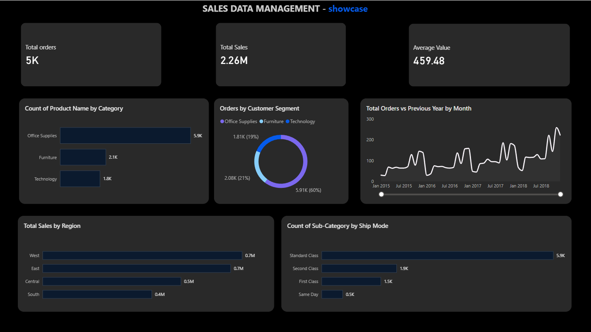
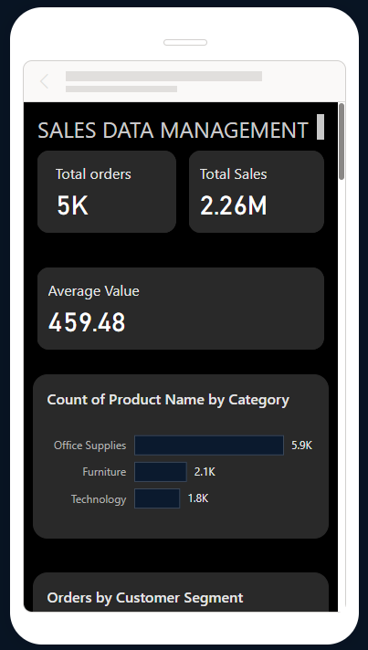

# 📊 Executive Sales & Revenue Performance Dashboard


## 📌 Business Case & Overview
Designed and engineered an enterprise-grade, dual-view interactive Power BI dashboard analyzing operational e-commerce performance. The solution synthesizes multi-category transactional data to provide executive stakeholders with high-level KPI tracking, regional revenue concentration metrics, and product performance breakdowns.

---

## 📸 Interactive Dashboard Previews

### 💻 Desktop Executive View (16:9 Dark Theme)


### 📱 Responsive Mobile View


---

## 💡 Executive Insights & Key Metrics
* **Total Revenue Generation:** Achieved **$2.26M in total sales** across **5K+ customer orders**, yielding a stable **$459.48 Average Order Value (AOV)**.
* **Geographic Revenue Concentration:** The **West** ($0.7M) and **East** ($0.7M) regions dominate top-line revenue, representing the core growth drivers.
* **Category Dynamics:** Office Supplies represents the largest transaction volume (5.9K items), while Technology yields the highest revenue per transaction.

---

## 🛠️ Data Pipeline & Technical Architecture

### 1. Data Transformation (Power Query)
* Ingested transactional sales data and enforced strict schema validation.
* Explicitly configured temporal field data types (`Order Date`, `Ship Date`) and numeric values (`Sales`).
* Verified dataset integrity and handled missing values across geographical dimensions.

### 2. Analytical Engine & DAX Modeling
Implemented a dedicated explicit measure store (`_Measurement`) to ensure clean DAX dependency trees and performance efficiency:

```dax
// Total Revenue Calculation
Total Sales = SUM(Sales_Data[Sales])

// Dynamic Order Volume Count
Total Orders = DISTINCTCOUNT(Sales_Data[Order ID])

// Average Order Value (AOV) Handling Division by Zero
Average Value = DIVIDE([Total Sales], [Total Orders], 0)
